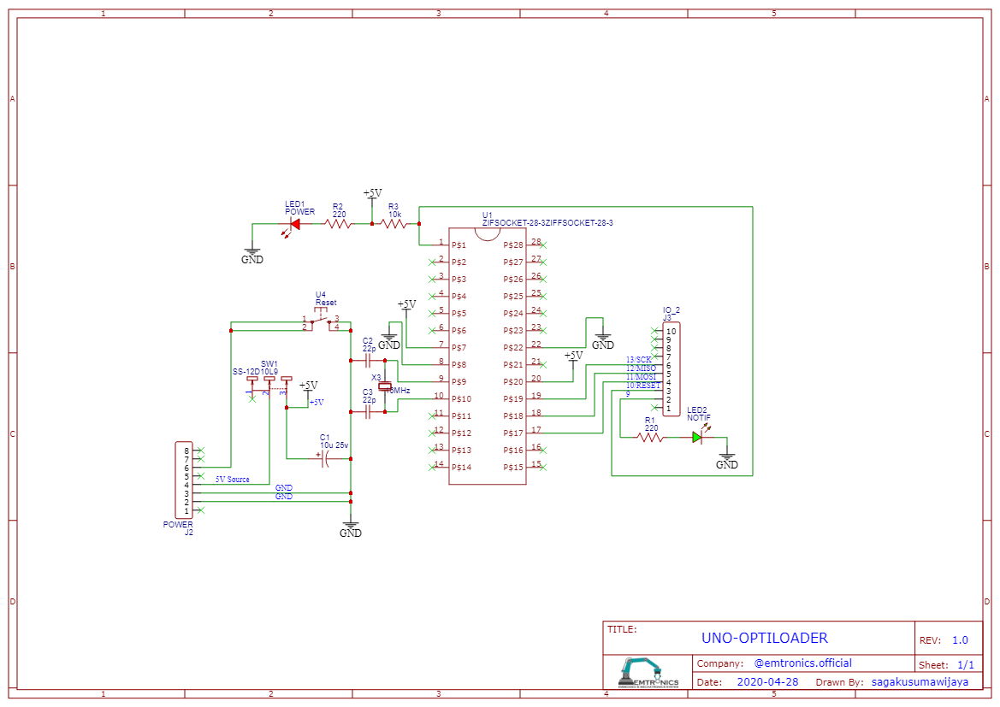

# UNO_OptiLoader_Shield
An Uno's shield to bootloads ATMega8, ATMega48, ATMega88, ATMega168, ATMega328 DIP Package.

## PCB Top Side

## PCB Bottom Side

## Schematic 1

## Schematic 2

## [Code](OptiLoader-master.zip)
